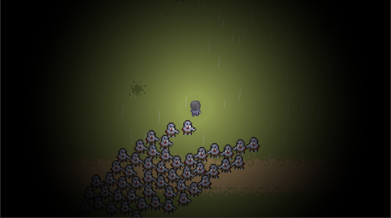
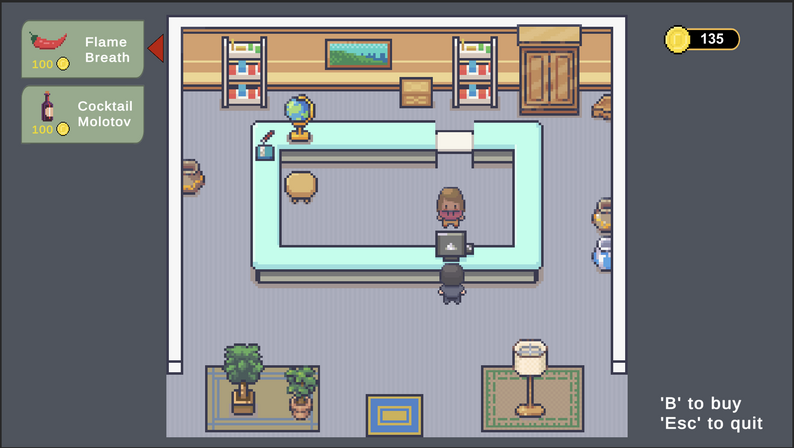
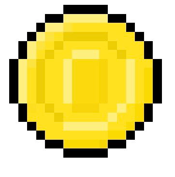

	 
  
	 
The apocalypse has taken hold, and as the monsters close in, little hope is left for the students at FEUP. Try to survive long enough in this hellish place surrounded by a horde of grotesque monsters that seemed to have crawled their way up from the underworld.

# User Interface
<table>
   <tr>
    <th>Main Menu</th>
    <th></th>
  </tr>
  <tr>
    <th>Game Play</th>
    <th></th>
  </tr>
  <tr>
    <th>Open World</th>
    <th></th>
  </tr>
  <tr>
    <th>Puzzle</th>
    <th></th>
  </tr>
  <tr>
    <th>Store (Dona Beatriz)</th>
    <th></th>
  </tr>
  
</table>

# Demo
https://github.com/luismrguimaraes/FEUPocalypse/assets/100025288/92cb6552-e80d-48a5-a8e2-4c489db37f46

# How to Play
## Controls:
| Control       | Key/Command            |
|---------------|------------------------|
| Move          | WASD/Arrow Keys/Joystick |
| Select        | ENTER                  |
| Go Back       | Backspace or ESC       |

### Collectibles:
- : Spend at the shop
- : Full vision for a given duration
- : Increased movement speed for a given duration

### Weapons:
- : Shoot notes
- : Blow fire when facing horizontally
- : Drop an explosive cocktail at your current position

### Player Levels:
- Every 5 levels HP is fully recovered
- Upgrades:
  - Lvl 3: Shoots backwards
  - Lvl 6: Deals more damage
  - Lvl 9: Is not destroyed on contact

# Authors and Acknowledgement
## Programming:
- [Luís Guimarães](https://luismrguimaraes.github.io/)
- [Fábio Huang](https://github.com/FabioMiguel2000)
## UI:
- [Fábio Huang](https://github.com/FabioMiguel2000)
## Audio Work:
- [Luís Guimarães](https://luismrguimaraes.github.io/)
## Visual/Animation Assets:
- [PixiVan](https://pixivan.itch.io/)
- [Pimen](https://pimen.itch.io/)
- ["Mega PixelArt Icons"](https://poloviiinkin.itch.io/mega-pixel-art-32x32-px-icons-sprite-sheet)
- ["Modern Interiors"](https://limezu.itch.io/moderninteriors/devlog/244045/free-version-overview-18042021-update)
- ["Coin"](https://www.pixilart.com/art/coin-sprite-sheet-c7f297523ce57fc)
- ["WASD"](http://pixelartmaker.com/art/c0e14b48a37d57f)
- ["Arrow Keys"](http://pixelartmaker.com/art/7efa119103ffc71)
